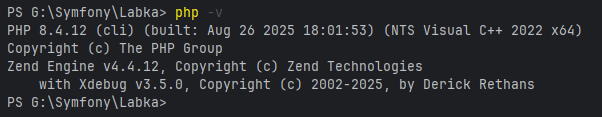
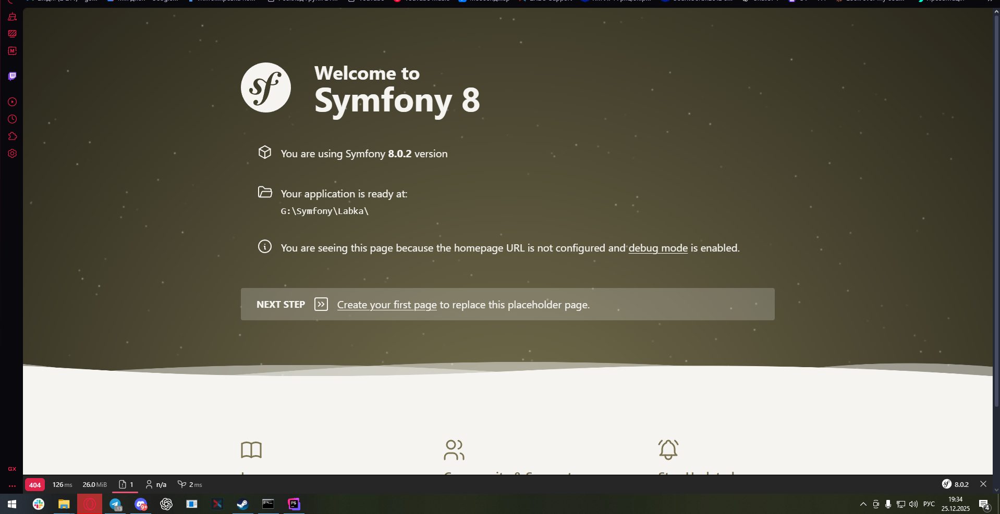
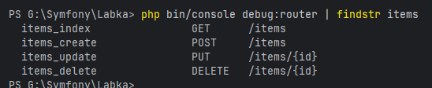
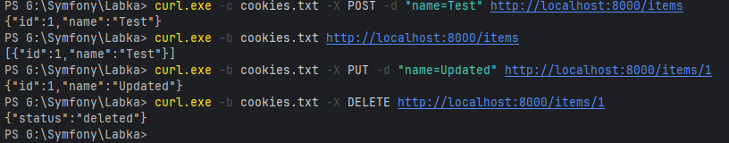
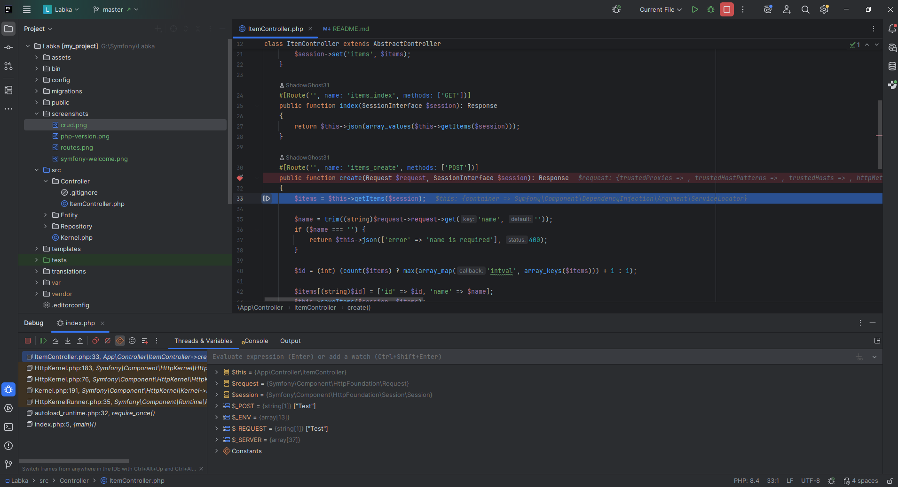

# Symfony Labs Project

Репозиторій для виконання лабораторних робіт з дисципліни **Symfony / PHP Frameworks**.  
Усі лабораторні роботи виконуються в рамках **одного проєкту**.

---

## Лабораторна робота №1  
**Тема:** Встановлення та початкове налаштування Symfony

---

## Лабораторна робота №6
**Тема:** API Platform — CRUD для однієї сутності + Swagger

Інструкція та опис виконання: **README_Lab6.md**

---

## Встановлення PHP
Для роботи з фреймворком Symfony використовується PHP.

> Symfony 6.4 потребує сучасну версію PHP (8.x).  
> У рамках лабораторної роботи використовується **PHP 8.4**.

Перевірка версії:
```bash
php -v
```

📸 **Скріншот перевірки PHP:**


---

## Запуск проєкту
Для запуску використовується вбудований PHP сервер:

```bash
php -S localhost:8000 -t public
```

Після запуску проєкт доступний за адресою:  
http://localhost:8000

📸 **Стартова сторінка Symfony:**


---

## Створення Controller та CRUD
Controller створено за допомогою команди:

```bash
php bin/console make:controller ItemController
```

У контролері реалізовано **4 CRUD-операції без використання бази даних**:
- Create
- Read
- Update
- Delete

Дані зберігаються у **сесії**.

### Реалізовані маршрути:
- `GET /items`
- `POST /items`
- `PUT /items/{id}`
- `DELETE /items/{id}`

📸 **Скріншот маршрутизатора (`debug:router`):**


### Скріншот тестування CRUD
- **Create (POST):**
- **Read (GET):**
- **Update (PUT):**
- **Delete (DELETE):**
  

---

## GitHub репозиторій
Проєкт розміщено в **GitHub-репозиторії**.

Доступ до репозиторію надано:
📧 **kipz_goo@ztu.edu.ua**

---

## Встановлення та налаштування Xdebug
Xdebug встановлено та налаштовано для налагодження в **PhpStorm**.

📸 **Перевірка Xdebug (`php -v`):**


